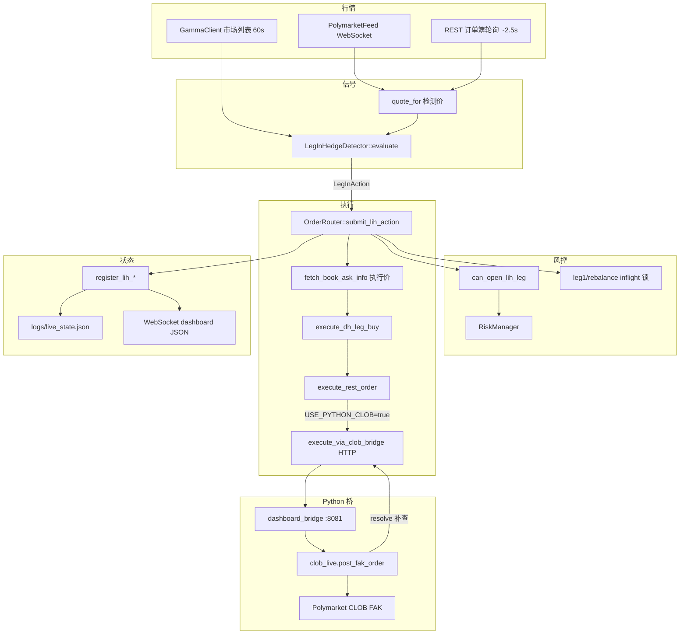

# 实盘 LIH 下单逻辑

本文档整理当前代码库中 **实盘（`PAPER_MODE=false`）LIH 分腿对冲** 从信号到成交的完整链路。主控在 `trading-core/src/main.cpp`，下单执行在 `OrderRouter::submit_lih_action`。

---

## 1. 总览



**与纸面的分界**：`main.cpp` 中 `paper_mode == false` 时，`execute_lih_action` 只调用 `router.submit_lih_action`，不走纸面滑点/深度模拟分支。

---

## 2. 启动条件

| 条件 | 环境变量 / 代码 | 说明 |
|------|-----------------|------|
| 实盘模式 | `PAPER_MODE=false` | 否则全部走纸面 `execute_lih_action` 分支 |
| LIH 策略 | `LIH_ENABLED=true` | 关闭则不走 LIH 检测 |
| 真下单 | `LIVE_LIH_DRY_RUN=false` | `true` 时只 shadow：登记持仓、打日志，**不发 CLOB 单** |
| Python CLOB | `USE_PYTHON_CLOB=true`（默认） | C++ 走本地 bridge，不直接 POST `clob.polymarket.com` |
| Bridge 地址 | `CLOB_BRIDGE_HOST` / `CLOB_BRIDGE_PORT` | 默认 `127.0.0.1:8081` |
| 交易允许 | `RiskManager::is_trading_allowed()` | `ACTIVE` 才可开新 leg1；暂停时已有持仓可对冲 |
| 凭证 | `POLYMARKET_PRIVATE_KEY`、`POLYMARKET_FUNDER` 等 | 启动时校验，缺失则 `main` 退出 |

`OrderRouter` 构造时：`live_lih_dry_run_ = live_lih_dry_run && !paper_mode`（纸面强制 shadow 语义无效）。

---

## 3. 主循环触发（`main.cpp`）

主循环约 **250ms** 一轮：

1. **REST 订单簿刷新**（若 `DH_BOOK_AWARE_DETECT` 或纸面 `PAPER_OFFICIAL_BOOK`）：`router.refresh_rest_book(tokens)` → 写入 `StateStore.rest_book_asks_`
2. **市场列表刷新**（60s）：`GammaClient::fetch_updown_markets` → 更新 token 列表 → `poly_feed->subscribe(tokens)`
3. **LIH 评估**：`try_lih_evaluate()` → `lih_detector->evaluate(now_ms, risk_manager)`
4. **有动作则执行**：`router.submit_lih_action(act, now_sec)`；成功则 `save_live_lih_state`
5. **输出状态**：`store.get_dashboard_json()` → stdout → `dashboard_bridge` 广播 Web

**Polymarket WS tick** 也会触发 `try_lih_evaluate()`（`poly_feed->set_tick_callback`），因此检测频率高于 250ms。

实盘 **不** 调用 `store.reload_live_mirror()`（仅纸面每轮读 `live_mirror.json`）。

---

## 4. 信号生成（`LegInHedgeDetector`）

### 4.1 检测用报价 `quote_for`

优先级（与执行价分离）：

1. `book_aware_detect` → `get_detection_ask`（WS + REST 取保守 ask）
2. `paper_official_book` → **仅纸面**
3. `LIH_USE_MIRROR` → `get_mirror_quote`（读 `live_mirror.json` 缓存）
4. 兜底 → `get_token_price`（WS `price_change`）

实盘通常依赖 **1 + 4**；mirror 在 live 下默认不 reload，可能为空。

### 4.2 五种 `LegInAction`

| Kind | 场景 | 检测逻辑摘要 |
|------|------|----------------|
| `OpenLeg1` | 无持仓 | 便宜一侧 ask ≤ `LIH_LEG1_MAX_PRICE`，窗口剩余 ≥ `LIH_LEG1_MIN_SECONDS_REMAINING` |
| `CompleteHedge` | YES/NO 不平衡 | 买轻腿；`heavy_avg + light_ask ≤ LIH_TARGET_COMBINED` 或 force 窗口 |
| `HeavyDilute` | flex 模式稀释 | 买重腿一侧（价仍受 leg1_max 约束） |
| `ScalePaired` | 已平衡且组合价够低 | 同时加 YES+NO |
| `DilutePaired` | flex 稀释配对 | 双边同时加仓 |

检测阶段已调用 `can_open_lih_leg`；执行阶段 **再次** 拉 REST 订单簿并校验。

---

## 5. 风控闸门（`RiskManager`）

### 5.1 `can_open_lih_leg`

- 交易状态：`PAUSED` / `KILLED` 时禁止新 leg1；**已有 `lih_id` 的对冲腿可放行**
- `RISK_MAX_CONCURRENT_POSITIONS`
- `LIH_SESSION_MAX_LEGS`（默认 2：leg1 + hedge）
- `LIH_MIN_BALANCE_USDC`
- 单笔成本 ≤ 余额 × `RISK_MAX_POSITION_FRACTION`
- 单笔 ≥ $1（交易所最小）
- `LIH_ONE_SLOT_GLOBAL`：其他 asset/window 槽位占用时拒绝新 leg1
- `LIH_MAX_USDC_PER_SLOT` 槽位预算
- `LIH_MAX_MATCHED_SHARES` 对冲加仓上限

### 5.2 Inflight 锁（防重复下单）

| 锁 | 申请 | 释放 |
|----|------|------|
| `lih_leg1_inflight_` | `try_begin_lih_leg1` | 成交 `register_lih_open_leg1`；失败且无 `order_id` 时 `end_lih_leg1_inflight` |
| `lih_rebalance_inflight_` | `try_begin_lih_rebalance` | 成交 `register_lih_add_*`；明确失败 `end_lih_rebalance_inflight` |

**关键**：若 CLOB 返回 `order_id` 但 `fill=0`，标记 `pending_fill`，**保持 inflight、不释放锁、不登记持仓**，避免重复 leg1。

---

## 6. 执行入口 `OrderRouter::submit_lih_action`

`paper_mode_` 时直接 `return false`（实盘专用）。

### 6.1 通用执行前步骤

对每条腿：

1. `fetch_book_ask_info(token_id)` — **REST 实时订单簿**（与检测价独立）
2. `exec_px = book.best_ask`
3. `resize_for_ask_book` — 按深度缩小张数（`depth / kDepthFillRatio`）
4. `leg_meets_minimum` — 满足交易所最小名义
5. `can_open_lih_leg` — 再次风控
6. inflight 锁

### 6.2 `OpenLeg1`（第一腿）

```
REST 簿 → 价 ≤ LIH_LEG1_MAX_PRICE
→ try_begin_lih_leg1
→ [LIVE_LIH_DRY_RUN] register + shadow 日志，return
→ execute_dh_leg_buy
→ [可选] resolve_clob_fill 补查
→ pending_fill → 保持锁，return false
→ 有 order_id 未确认 → 保持锁，return false
→ 无 order_id 真失败 → end_lih_leg1_inflight
→ 成功 → register_lih_open_leg1（写内存持仓，扣余额）
```

### 6.3 `CompleteHedge` / `HeavyDilute`（单腿对冲/稀释）

- Hedge 额外校验：`heavy_avg + exec_px ≤ LIH_TARGET_COMBINED`（`note` 含 `force` 可跳过）
- `try_begin_lih_rebalance(lih_id)`
- 成交路径同 leg1：`execute_dh_leg_buy` + `resolve_clob_fill` + pending 锁逻辑
- 成功 → `register_lih_add_leg`

### 6.4 `ScalePaired` / `DilutePaired`（双腿）

- 校验 `exec_yes + exec_no ≤ target`
- **顺序**：先 YES `execute_dh_leg_buy`，再 NO
- NO 失败 → `execute_unwind_sell` 回滚 YES，打 `CRITICAL` 遥测
- 成功 → `register_lih_add_paired`

---

## 7. CLOB 下单链

### 7.1 `execute_dh_leg_buy`

```text
build_order(token, price, shares, BUY)
→ EIP712 sign（neg_risk 选不同 exchange）
→ execute_rest_order(..., register_position=false)
```

LIH 成交后由 `register_lih_*` 登记持仓，不在 bridge 里 `register_trade_open`。

### 7.2 `execute_rest_order` 分支

| `USE_PYTHON_CLOB` | 路径 |
|-------------------|------|
| `true`（默认） | `execute_via_clob_bridge` → POST `http://127.0.0.1:8081/internal/clob/order` |
| `false` | C++ 直连 `https://clob.polymarket.com/order`（HMAC + EIP712 payload） |

### 7.3 `execute_via_clob_bridge`（C++）

请求体：

```json
{
  "token_id": "...",
  "price": 0.42,
  "size_shares": 10,
  "side": "BUY",
  "neg_risk": false
}
```

响应处理：

| 情况 | `LegFillResult` |
|------|-----------------|
| HTTP 200 + `success` + `size_shares > 0` | `success=true` |
| 有 `order_id` 但 fill=0 / success=false | `pending_fill=true` |
| HTTP 非 200 但 body 含 `order_id` | 尝试解析，可能 `pending_fill` |

### 7.4 `dashboard_bridge.py` → `clob_live.py`

- **`POST /internal/clob/order`**：调用 `post_fak_order`；**始终 HTTP 200**（避免 C++ 丢弃 body）
- **`POST /internal/clob/resolve`**：调用 `resolve_order_fill`（C++ 首轮 0 成交时二次查询）

`post_fak_order` 流程：

1. 价格/张数 CLOB 舍入
2. 刷新 USDC allowance（best-effort）
3. `create_and_post_order(..., order_type=FAK)`
4. `_normalize_result`：
   - CLOB `get_order` 轮询 40×0.35s
   - 仍无成交 → `fetch_user_trades` activity 兜底
5. 返回 `{ success, price, size_shares, order_id, status, error }`

### 7.5 `resolve_clob_fill`（C++ 二次确认）

首轮 `execute_dh_leg_buy` 返回 0 成交且 `USE_PYTHON_CLOB` 时：

```text
POST /internal/clob/resolve { token_id, price, side, order_id }
→ resolve_order_fill（更长 activity 窗口）
→ 仍失败且已有 order_id → pending_fill，保持 inflight
```

---

## 8. 持仓登记与持久化

| 事件 | 函数 | 副作用 |
|------|------|--------|
| Leg1 成交 | `register_lih_open_leg1` | 新建 `LIH-{asset}-{ts}`，扣余额，`lih_session_legs_used++`，清 leg1 inflight |
| 单腿对冲 | `register_lih_add_leg` | 更新 yes/no 成本与张数，清 rebalance inflight |
| 配对加仓 | `register_lih_add_paired` | 双边同时增加 |
| 窗口结算 | `check_and_close_lih_positions` | 结算 PnL，可选 `AUTO_REDEEM` |
| 磁盘 | `save_live_lih_state` | `logs/live_state.json`（含 status、open_lih、inflight） |

Web 持仓来自 **C++ 内存**经 WS 推送；若 fill 未登记则链上有仓、Web 显示 0。可用 `scripts/live_lih_reconcile.py` 从 activity 重建。

---

## 9. 控制与暂停

| 机制 | 行为 |
|------|------|
| Web `POST /api/control` pause | 写 `logs/runtime_config.json` → `apply_runtime_config` → `RiskManager::pause` |
| `logs/STOP_TRADING` 文件 | 启动强制 PAUSED；阻塞 resume |
| `LIH_PAUSE_AFTER_ROUND` | leg1+hedge 或结算后自动 pause |
| `runtime_config` | 每轮读取后 **删除文件**（一次性指令） |

手动 pause 会清除 circuit breaker 自动恢复计时，避免误 RESUME。

---

## 10. 关键环境变量速查

| 变量 | 默认 | 作用 |
|------|------|------|
| `PAPER_MODE` | true | false 才走本文档链路 |
| `LIVE_LIH_DRY_RUN` | true | true=shadow 不下真单 |
| `USE_PYTHON_CLOB` | true | C++→Python bridge |
| `LIH_LEG1_MAX_PRICE` | 0.45 | leg1 最高价 |
| `LIH_TARGET_COMBINED` | 0.95 | 对冲组合价上限 |
| `LIH_LEG1_SHARES` | 10 | leg1 目标张数 |
| `LIH_ONE_SLOT_GLOBAL` | 随 max_pos | 全局单槽 |
| `LIH_SESSION_MAX_LEGS` | 2 | 每轮最多腿数 |
| `LIH_USE_MIRROR` | true | 检测价用 mirror（live 需自行保证有数据） |
| `DH_BOOK_AWARE_DETECT` | true | 检测价 WS+REST |
| `RISK_MAX_CONCURRENT_POSITIONS` | 3 | 最大并发持仓 |
| `RISK_MAX_POSITION_FRACTION` | 0.08 | 单笔上限占余额比例 |

---

## 11. 相关源文件

| 文件 | 职责 |
|------|------|
| `trading-core/src/main.cpp` | 主循环、实盘/纸面分叉、`try_lih_evaluate` |
| `trading-core/src/signals/LegInHedgeDetector.cpp` | 信号与检测价 |
| `trading-core/src/exec/OrderRouter.cpp` | 实盘执行、bridge、REST 簿 |
| `trading-core/src/risk/RiskManager.cpp` | 风控、inflight、持仓 |
| `trading-core/src/feeds/PolymarketFeed.cpp` | WS 行情 |
| `dashboard_bridge.py` | `/internal/clob/*`、Web API |
| `clob_live.py` | FAK 下单、轮询、activity 兜底 |
| `scripts/live_lih_reconcile.py` | 链上成交 → live_state 修复 |

---

## 12. 检测价 vs 执行价（常见困惑）

| 阶段 | 价格来源 | 用途 |
|------|----------|------|
| **检测** | `quote_for`（WS / REST 缓存 / mirror） | 决定是否发出 `LegInAction` |
| **执行** | `fetch_book_ask_info`（当场 REST） | 实际限价与张数 |

因此可能出现：日志里检测 `entry-wait | no quote`，或检测有价但执行时簿已变薄/变贵被 skip。实盘以 **执行前 REST 簿** 为准。

---

*文档对应仓库修复批次（含 `resolve_clob_fill`、bridge 恒 200、pending inflight 锁）。*
