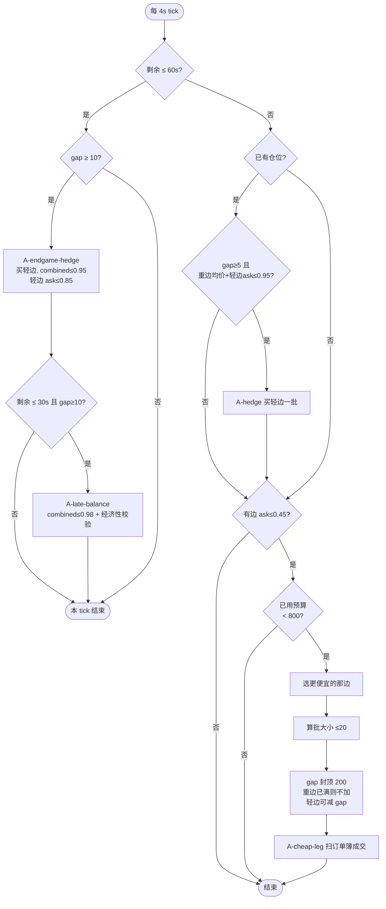
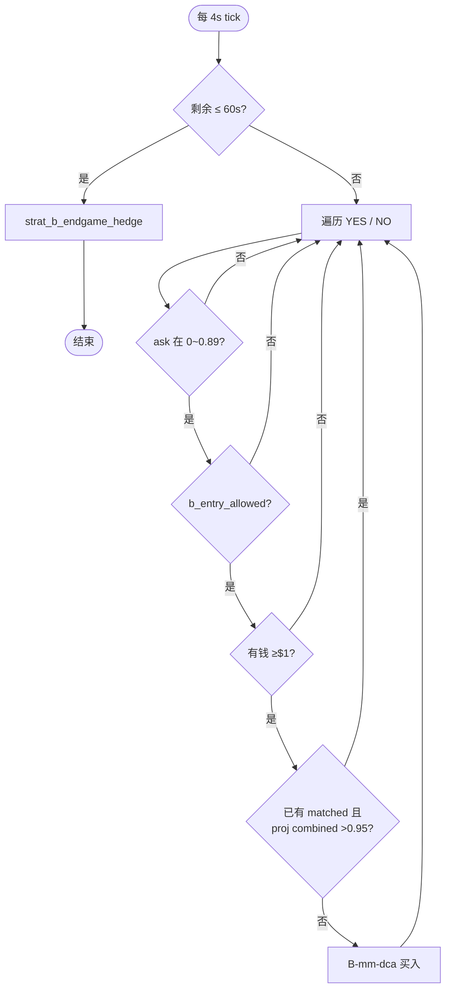
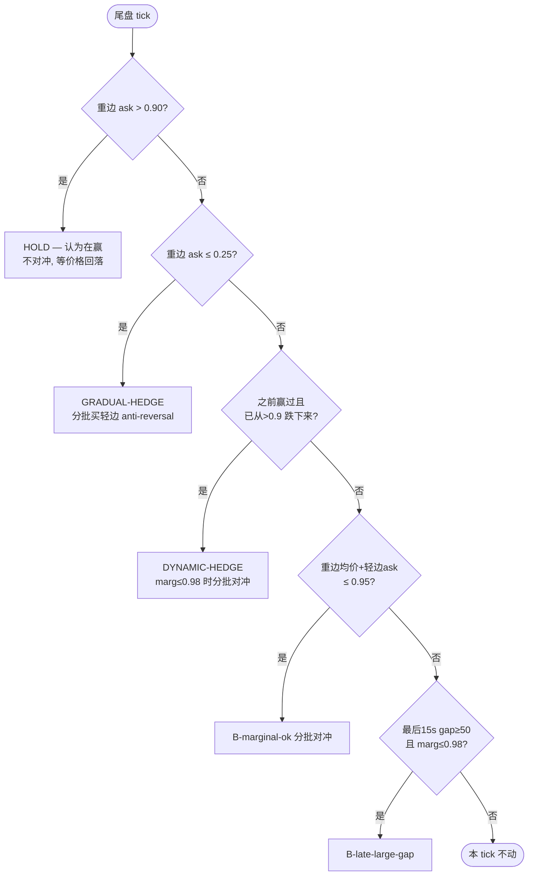
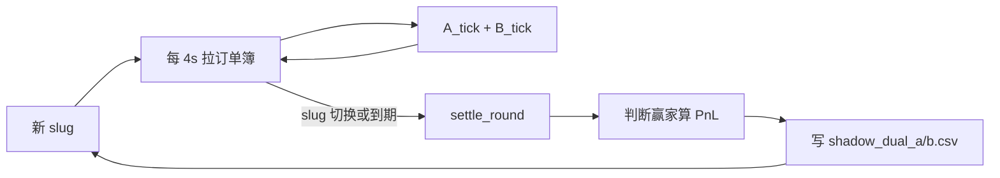

# Shadow 双策略流程说明（A + B）

> 对应脚本：`scripts/shadow_dual_strategies.py`  
> 更新：gap 封顶、订单簿深度/滑点模拟、B 中场收紧规则

**看流程图**：请用浏览器打开同目录下的 **`shadow_dual_strategies_flow.html`**（双击即可，图表会自动渲染）。  
本 `.md` 里的 ` ```mermaid ` 代码块在普通编辑器里只会显示文字，需要 Markdown 预览或 HTML 才能看到图。

---
## 共用框架

每轮对应一个 BTC 5m 市场（`btc-updown-5m-{ts}`）。

| 概念 | 说明 |
|------|------|
| **预算** | A、B 各 $1000，互不共用 |
| **gap** | `abs(YES份数 − NO份数)`，未对冲敞口 |
| **combined** | 双边都有仓时 = YES均价 + NO均价；只有单边时 = 该边均价 |
| **批大小** | 最多 20 份/批，受现金和 gap 约束 |
| **成交模拟** | 扫 ask 多档订单簿，可能部分成交、均价高于 best ask |
| **结算** | 轮末按盘口判断赢家（ask 高且 >0.55 的那边 = $1，另一边 = $0） |

### 关键阈值（`.env` 可调）

```
SHADOW_STRAT_BUDGET=1000        # 每策略预算
SHADOW_TARGET_COMBINED=0.95     # 正常对冲目标
SHADOW_ENDGAME_MAX_COMBINED=0.98  # 尾盘可放宽上限
ENDGAME_SEC=60                  # 最后 60 秒算尾盘

A:
  CHEAP_MAX=0.45              # 只买 ask ≤ 0.45
  SHADOW_A_RESERVE=200        # 预留 $200 给尾盘对冲
  SHADOW_A_MAX_GAP=200        # gap 封顶 200 份
  SHADOW_MAX_HEDGE_ASK=0.85   # 对冲时轻边 ask 上限

B:
  MM_MAX_BUY=0.89             # 中场最高买入价
  B_EXPENSIVE_LEG=0.50        # combined 偏高时不买 ≥0.50
  B_CHEAP_DILUTE=0.45         # combined>0.95 时只买 <0.45
  MM_NO_BUY_HEAVY=0.90        # 尾盘重边 ask>0.90 → HOLD
  MM_EXPOSURE_CHEAP=0.25      # 重边 ask≤0.25 → 分批对冲
  SHADOW_LARGE_GAP=50         # 大 gap 经济性判断阈值
```

---

## 策略 A：cheap_sweep（便宜边扫货 + 配对）

**思路**：只在便宜边（ask ≤ 0.45）分批买入，有机会就把 combined 压到 ≤0.95；尾盘强制配平。gap 最多堆到 **200 份**。

### A 策略主流程



### A 分阶段说明

#### 1. 中场（剩余 > 60s）

- **入场**：YES 或 NO 的 ask ≤ 0.45 才买；两边都便宜时买 **更便宜** 的那边。
- **加仓限制**：
  - 可用预算 = $1000 − $200 reserve = **$800**（reserve 留给尾盘对冲）。
  - gap 封顶 **200**：重边 gap 到 200 后不再加重边；只能买轻边对冲。
- **主动对冲**：若已有仓位、gap ≥ 5，且 `重边均价 + 轻边 ask ≤ 0.95` → 买一批轻边（`A-hedge`）。

#### 2. 尾盘（剩余 ≤ 60s）

- 只做对冲，**不再扫便宜边**。
- `gap ≥ 10` → `A-endgame-hedge`（combined ≤ 0.95，轻边 ask ≤ 0.85，可用半个 reserve）。
- 最后 30 秒、gap ≥ 10 → `A-late-balance`（combined ≤ 0.98，**必须过经济性**：锁利 vs 裸敞口比较）。

#### 3. A 不会做的事

- 不买 0.45 以上的边（中场）。
- 不做 B 那种「两边都 DCA」。
- 尾盘不会在重边 ask > 0.9 时故意 HOLD（会尽量对冲）。

### A gap 封顶逻辑（`a_max_entry_shares`）

| 状态 | 行为 |
|------|------|
| gap ≥ 200，买重边 | 拒绝（0 份） |
| gap ≥ 200，买轻边 | 允许（减 gap） |
| gap < 200，买重边 | 最多买到 gap=200 |
| 空仓首笔 | 单笔最多 200 份 |

---

## 策略 B：mm_dca（双边做市式 DCA + 智能尾盘）

**思路**：中场两边 ask ≤ 0.89 时都可以买，但 combined 高了会收紧；尾盘根据 **重边盘口** 决定 HOLD / 分批对冲 / 等跌后再对冲。

### B 策略主流程（中场）



### B 中场入场规则（`b_entry_allowed`）

| 情况 | 规则 |
|------|------|
| 还没双边仓，盘口 sum > 0.97 | 不买 **更贵** 的那边（先买便宜的） |
| 双边都有，combined > 0.95 | 只允许 ask **< 0.45** 的便宜腿稀释 |
| 双边都有，combined 在 0.92~0.95 | 不买 ask **≥ 0.50** 的贵腿 |
| 只有单边仓 | 若 `本边均价 + 对面 ask > 0.95` → 不买对面 |
| combined 已经 ≤ 0.93 | 不买 ask > 0.55 的边 |
| 额外 | projected combined 买后 > 0.95 → 跳过 |

### B 尾盘流程（最后 60s，只做对冲）

前提：有重边、gap ≥ 5。



### B 分批对冲细节（`b_gradual_hedge_batch`）

- 每批 ≤ 20 份；gap ≥ 50 时批大小 ×0.75。
- projected combined 不能超过 **0.98**（超了会缩小批次，每次减 5 份）。
- gap ≥ 50 或重边均价很便宜（≤0.30）→ 跑 **经济性（ECON）**：

| ECON 条件 | 结果 |
|-----------|------|
| combined > 0.98 | 跳过 |
| 锁利 > $0.05 | 对冲 |
| gap 大 + 便宜敞口，对冲亏 ≤ 裸亏 25% | 对冲 |
| gap 大 + 小亏对冲可接受 | 对冲 |
| gap 小 + 亏不多且 combined ≤ 0.98 | 对冲 |
| 否则 | SKIP |

---

## 共用：对冲函数 `try_hedge_light`

买 **轻边**（份数少的那边），用于 A 对冲和 B 分批对冲。

检查顺序：

1. 有重边且 gap > 0
2. 轻边 ask ≤ `max_light_ask`
3. 边际 combined = 重边均价 + 轻边 ask ≤ `max_combined`
4. projected combined（整批买完后）≤ `max_combined`
5. 可选：`require_economics` → 调用 `hedge_economics`
6. 现金够（可用 `emergency` 额外额度）
7. `walk_ask_fill` 扫订单簿成交

---

## 共用：成交模拟 `walk_ask_fill`

1. 拉 CLOB 完整 ask ladder（多档价格）
2. 从 best ask 往上吃，每档可用量 × `SHADOW_BOOK_TAKE_RATIO`
3. 成交价可加 `SHADOW_SLIPPAGE_PCT` 滑点
4. 深度不够 → 部分成交，日志：`fill 8.0/20.0sh` 或 `NO-FILL … 吃不满`
5. 扫多档 → 日志：`slip avg=0.3520 best=0.3400`

---

## 一轮生命周期



结算规则：

- `yes_ask >= no_ask` 且 `yes_ask > 0.55` → YES 赢（$1/share）
- 否则 NO 赢
- PnL =  proceeds − (yes_cost + no_cost + fees)

---

## A vs B 对比

| | **A cheap_sweep** | **B mm_dca** |
|--|-------------------|--------------|
| **入场条件** | 仅 ask ≤ 0.45 | ask ≤ 0.89（多重过滤） |
| **方向** | 偏单边扫便宜 | 双边 DCA |
| **gap 控制** | 硬封顶 200 | 无硬顶，靠经济性 + 分批 |
| **对冲目标** | combined ≤ 0.95 | 中场 ≤0.95；尾盘 ≤0.98 |
| **尾盘** | 强制对冲 | 赢边 >0.9 可 HOLD |
| **reserve** | $200 专供尾盘 | 无 reserve |
| **典型形态** | 先堆便宜边再配 | 两边慢慢建，尾盘智能处理 |

---

## 日志与结果文件

| 文件 | 内容 |
|------|------|
| `logs/shadow_dual.log` | 实时交易日志 |
| `logs/shadow_dual_monitor.log` | run 脚本 tee 输出 |
| `logs/shadow_dual_a.csv` | A 每轮结算 |
| `logs/shadow_dual_b.csv` | B 每轮结算 |

常见日志标签：

- `A-cheap-leg` / `A-hedge` / `A-endgame-hedge` / `A-late-balance`
- `B-mm-dca` / `HOLD endgame` / `GRADUAL-HEDGE` / `DYNAMIC-HEDGE`
- `B-marginal-ok` / `B-after-drop` / `B-late-large-gap` / `ECON`

---

## 启动命令

```bash
# 跑 N 秒（例：9 小时 = 32400）
/chuan/saibo-trader-trend/scripts/shadow_dual_run.sh 32400

# 无限跑
/chuan/saibo-trader-trend/scripts/shadow_dual_run.sh
```
