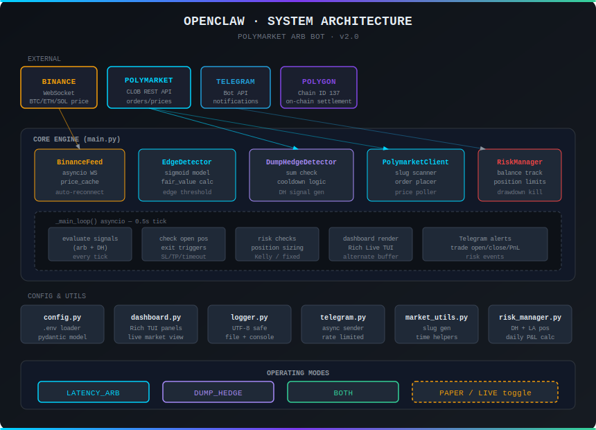

# Architecture — OPENCLAW · POLYMARKET ARB BOT

> Technical reference for the dual-strategy Polymarket arbitrage bot.
> For setup and usage, see [README.md](README.md).
>
> 

---

## Table of Contents

- [System Overview](#system-overview)
- [Component Map](#component-map)
- [Data Flow](#data-flow)
- [Core Components](#core-components)
  - [main.py — Orchestrator](#mainpy--orchestrator)
  - [BinanceWebSocketFeed](#binancewebsocketfeed)
  - [EdgeDetector](#edgedetector)
  - [DumpHedgeDetector](#dumphedgedetector)
  - [PolymarketClient](#polymarketclient)
  - [KellySizer](#kellysizer)
  - [RiskManager](#riskmanager)
- [Support Components](#support-components)
  - [utils/retry.py](#utilsretrypy)
  - [utils/dashboard.py](#utilsdashboardpy)
  - [utils/logger.py](#utilsloggerpy)
  - [integration/telegram.py](#integrationtelegrampy)
  - [integration/openclaw.py](#integrationopenclawpy)
- [Market Discovery Strategy](#market-discovery-strategy)
- [Fair Value Model](#fair-value-model)
- [Position Lifecycle — Latency Arb](#position-lifecycle--latency-arb)
- [Position Lifecycle — Dump Hedge](#position-lifecycle--dump-hedge)
- [Risk Layers](#risk-layers)
- [Concurrency Model](#concurrency-model)
- [Network Topology](#network-topology)
- [Key Design Decisions](#key-design-decisions)

---

## System Overview

Two independent strategies share the same infrastructure. The active strategy is controlled by `STRATEGY` in `.env`.

```
┌─────────────────────────────────────────────────────────────────────────────┐
│                     OPENCLAW · POLYMARKET ARB BOT                           │
│                                                                             │
│  External Feeds          Core Engine              External APIs             │
│  ──────────────          ───────────              ────────────             │
│                                                                             │
│  Binance WS  ──────────► EdgeDetector             Polymarket CLOB API      │
│  (latency_arb only)      (latency arb signals)    (FAK orders, prices)    │
│                               │                                            │
│  Polymarket REST ──────────► DumpHedgeDetector                             │
│  (dump_hedge mode)           (combined price scan)                         │
│                               │                                            │
│                          KellySizer / Fixed Bet                            │
│                          RiskManager (both pos types)                      │
│                               │                                            │
│  Notifications           Position Manager ────────► Telegram               │
│                          (arb + DH positions)       OpenClaw AI            │
│                                                                             │
│  Dashboard (Rich)   ◄──── All components (read-only stats)                 │
│  Log file           ◄──── All components                                   │
└─────────────────────────────────────────────────────────────────────────────┘
```

| Strategy | Binance WS | EdgeDetector | DumpHedgeDetector |
|----------|-----------|--------------|-------------------|
| `latency_arb` | ✓ required | ✓ active | — not started |
| `dump_hedge` | — not started | — not started | ✓ active |
| `both` | ✓ required | ✓ active | ✓ active |

---

## Component Map

```
polymarket_bot/
│
├── main.py                       ← Orchestrator: owns all components, runs the main loop
│
├── core/
│   ├── binance_ws.py             ← Real-time price feed (WebSocket, auto-reconnect)
│   ├── edge_detector.py          ← Latency arb signal engine (sigmoid model, cooldown)
│   ├── dump_hedge_detector.py    ← Dump hedge signal engine (combined price scanner)
│   ├── polymarket_client.py      ← CLOB API wrapper (market discovery, orders, fills)
│   └── polymarket_ws.py          ← Optional: PM real-time price WebSocket
│
├── risk/
│   ├── kelly.py              ← Position sizing (Kelly formula + fixed bet mode)
│   └── risk_manager.py       ← Kill switch, daily halt, balance tracking
│
├── integration/
│   ├── telegram.py           ← Push notifications (rate-limited, priority bypass)
│   └── openclaw.py           ← Bidirectional AI agent integration
│
├── utils/
│   ├── dashboard.py          ← Rich Live terminal dashboard (alternate screen)
│   ├── logger.py             ← Rotating file + coloured console handler
│   └── retry.py              ← Async/sync retry decorator (exponential backoff)
│
├── config.py                 ← BotConfig dataclass + .env loader + validate()
└── healthcheck.py            ← Pre-flight: Python version, packages, API, config
```

---

## Data Flow

```
                    ┌──────────────────────────────────────────────┐
                    │             MAIN LOOP  (20 Hz, asyncio)      │
                    └────────────────────┬─────────────────────────┘
                                         │
          ┌──────────────────────────────┼──────────────────────────────┐
          │                             │                              │
          ▼                             ▼                              ▼
  ┌──────────────┐             ┌─────────────────┐            ┌──────────────┐
  │ BinanceWS    │             │ _check_open_    │            │ HeartBeat    │
  │ Feed × N     │             │ positions()     │            │ Dashboard +  │
  │              │             │ (every 0.5s)    │            │ OpenClaw     │
  │ BTCUSDT      │             └────────┬────────┘            │ (every 2s)   │
  │ ETHUSDT      │                      │                     └──────────────┘
  │ SOLUSDT      │             ┌────────▼────────┐
  │ XRPUSDT      │             │ Exit logic:     │
  └──────┬───────┘             │ take profit     │
         │                     │ stop loss       │
         │ latest_price        │ timeout         │
         │ price_history       │ near-resolution │
         ▼                     └────────┬────────┘
  ┌──────────────┐                      │
  │ EdgeDetector │                      │ SELL order
  │ .evaluate()  │                      ▼
  │              │             ┌─────────────────┐
  │ Per asset:   │             │ PolymarketClient│
  │ - price lag  │             │ .place_market_  │
  │ - sigmoid    │             │ order(SELL)     │
  │ - edge calc  │             └────────┬────────┘
  └──────┬───────┘                      │
         │ TradeSignal                  │ OrderResult
         │ (if edge ≥ threshold)        ▼
         ▼                     ┌─────────────────┐
  ┌──────────────┐             │ RiskManager     │
  │ KellySizer   │             │ .register_      │
  │ .calculate() │             │ trade_close()   │
  └──────┬───────┘             └────────┬────────┘
         │ KellyResult                  │
         ▼                             │ Telegram notify
  ┌──────────────┐                     ▼
  │ RiskManager  │             ┌─────────────────┐
  │ .can_open_   │             │ EdgeDetector    │
  │ position()   │             │ .reset_cooldown │
  └──────┬───────┘             │ (asset)         │
         │ (allowed)           └─────────────────┘
         ▼
  ┌──────────────┐
  │ Polymarket   │
  │ Client       │
  │ .place_      │
  │ market_order │
  │ (BUY / FAK)  │
  └──────┬───────┘
         │ OrderResult
         ▼
  ┌──────────────┐
  │ RiskManager  │
  │ .register_   │
  │ trade_open() │
  └──────────────┘
```

---

## Core Components

### `main.py` — Orchestrator

**Responsibilities:**
- Constructs and wires all component instances
- Owns the asyncio event loop
- Runs the main trading loop at 20 Hz (`LOOP_INTERVAL_SECONDS = 0.05`)
- Handles `SIGINT`/`SIGTERM` for graceful shutdown
- Manages `asyncio.Task` lifecycle for all WebSocket feeds

**Key methods:**

| Method | Frequency | Purpose |
|--------|-----------|---------|
| `_main_loop()` | 2 Hz (0.5s tick) | Evaluate signals, check positions, render dashboard |
| `_check_open_positions()` | every tick | Exit logic for latency arb positions |
| `_check_open_dh_positions()` | every tick | Exit logic for dump hedge positions |
| `_handle_signal()` | On LA signal | Convert TradeSignal → BUY order |
| `_handle_dh_signal()` | On DH signal | Buy YES + NO simultaneously |
| `_close_position()` | On exit condition | SELL order + RiskManager update |

**Startup sequence:**

```
1. print_banner()
2. BotConfig.validate()
3. setup_logging()       ← file handler only (console still visible)
4. construct components
5. [live only] fetch_portfolio_balance() → update starting balance
6. start Binance WS feed tasks (asyncio.create_task)
7. send_bot_started() Telegram/OpenClaw
8. _get_live()           ← disable_console_logging() + start Rich dashboard
9. _trading_loop()
```

---

### `BinanceWebSocketFeed`

**File:** `core/binance_ws.py`

Maintains a persistent, auto-reconnecting WebSocket connection to Binance trade streams.

**Key design decisions:**

1. **Parallel endpoint probe on startup** — all 4 Binance endpoints (`data-stream.binance.com:9443/443`, `stream.binance.com:9443/443`) are raced concurrently. The first one to complete a handshake + receive a tick wins. Eliminates the 12-second sequential wait on startup.

2. **Sticky endpoint** — once a working endpoint is found, the bot stays on it. Only rotates after 3 consecutive failures on the same endpoint.

3. **Exponential backoff** — reconnect delay grows: `2s → 4s → 8s → 16s` (capped), then resets to `2s` after a successful connection.

4. **Stale-tick watchdog** — background coroutine checks every 10 seconds that a new tick has arrived within the last 30 seconds. If not, the WebSocket is forcibly closed to trigger a reconnect. Catches zombie TCP connections.

5. **REST bootstrap** — on first startup, fetches the current price via REST API (`data-api.binance.vision` first for geo-restriction avoidance) before WebSocket connects. Ensures the bot has a price immediately.

**History deque:** maintains a rolling 3,000-tick (~600-second at 5 ticks/sec) price history for `get_price_at(seconds_ago)` lookups.

---

### `EdgeDetector`

**File:** `core/edge_detector.py`

Evaluates every active Polymarket market against current Binance price data.

**Per-asset configuration:**

```python
ASSET_CONFIG = {
    "btc": {"base_scale": 500.0, "min_scale": 50.0,  "min_price_move": 5.0  },
    "eth": {"base_scale": 30.0,  "min_scale": 3.0,   "min_price_move": 0.53 },
    "sol": {"base_scale": 2.0,   "min_scale": 0.2,   "min_price_move": 0.05 },
    "xrp": {"base_scale": 0.3,   "min_scale": 0.05,  "min_price_move": 0.01 },
}
```

**Signal evaluation flow:**

```
For each asset in trading_markets:
  1. Check per-asset cooldown (_last_signal_time[asset])
  2. Get BinanceFeed.get_price_change(lag_window_seconds)
  3. If |change| < min_price_move → skip
  4. Fetch active 5m markets from PolymarketClient
  5. For each market:
     a. Parse price_to_beat from market question
     b. Compute seconds_remaining from endDate
     c. Compute fair_value = sigmoid((price_now - price_to_beat) / scale(t))
     d. edge = fair_value - pm_price
  6. If best_edge ≥ EDGE_MIN_EDGE_THRESHOLD → emit TradeSignal
  7. Set _last_signal_time[asset] = now
```

**Cooldown reset:** When a position closes, `main.py` calls `edge_detector.reset_cooldown(asset)` immediately — preventing the bot from waiting the full cooldown before re-evaluating the same asset.

---

### `DumpHedgeDetector`

**File:** `core/dump_hedge_detector.py`

Polls Polymarket markets every 2 seconds and emits a `DumpHedgeSignal` when the combined YES + NO ask price falls below the configured threshold.

**Evaluation flow:**

```
For each asset in trading_markets:
  1. Check per-asset cooldown (_last_signal_time[asset])
  2. Fetch active market via PolymarketClient (slug scan + cache)
  3. Get YES ask price + NO ask price
  4. combined = yes_ask + no_ask
  5. discount = 1.0 - combined
  6. If combined ≤ DH_SUM_TARGET AND discount ≥ DH_MIN_DISCOUNT → emit DumpHedgeSignal
  7. Set _last_signal_time[asset] = now
```

**Signal fields:**

```python
@dataclass
class DumpHedgeSignal:
    asset: str               # "btc" / "eth" / "sol" / "xrp"
    market: object           # resolved PolymarketMarket object
    yes_token_id: str        # CLOB token ID for YES leg
    no_token_id: str         # CLOB token ID for NO leg
    yes_price: float         # current YES ask
    no_price: float          # current NO ask
    combined_price: float    # yes_price + no_price
    locked_profit_per_share: float  # 1.0 - combined_price
    timestamp: float         # signal creation time (Unix)
```

**Active market cache:** `self._active_market_by_asset` is updated on every evaluation pass. `main.py` merges this cache with EdgeDetector's cache to populate the "Active Markets" dashboard panel regardless of which strategy is active.

---

### `PolymarketClient`

**File:** `core/polymarket_client.py`

**Authentication levels used:**
- Level 0 (no auth): market discovery, price queries
- Level 2 (API key derived from private key): order submission

**Market discovery strategy** (see [Market Discovery Strategy](#market-discovery-strategy) below).

**HTTP retry:** all `GET` requests go through `_get()`, decorated with `@async_retry(max_attempts=3, base_delay=0.5s, exceptions=(httpx.TransportError, httpx.TimeoutException))`. HTTP 4xx/5xx responses are **not** retried (expected "not found" responses).

**Order execution:**
- `place_market_order()` routes to `_simulate_paper_order()` or `_submit_live_order()`
- Live mode uses **FAK (Fill-And-Kill)** orders — no resting order book exposure
- SELL share count is reconciled against the on-chain `get_token_balance()` to handle partial fills accurately

**Redemption:**
- `redeem_positions(condition_id, outcome_index)` — calls CTF Exchange contract directly on Polygon via `web3` (optional dependency). Only needed as a safety net if a SELL order fails and the market resolves.
- `get_user_fills(funder_address)` — fetches trade history from `data-api.polymarket.com` (no auth required).

---

### `KellySizer`

**File:** `risk/kelly.py`

```
f* = (p × b - q) / b     where b = (1 - price) / price

Fractional Kelly: f = f* × RISK_KELLY_FRACTION
Capped at: RISK_MAX_POSITION_FRACTION × bankroll
```

**Fixed bet mode:** when `RISK_FIXED_BET_USDC > 0`, the Kelly formula is bypassed and the fixed amount is used directly (still subject to `RISK_MAX_POSITION_FRACTION` cap).

**Returns `None` when:**
- `win_probability ≤ current_price` (no edge)
- `bankroll × max_fraction < $1.00` (too small to trade)
- Any input is invalid (0, negative, etc.)

---

### `RiskManager`

**File:** `risk/risk_manager.py`

Tracks balances and enforces all trading limits.

**State machine:**

```
                ACTIVE
               /  |   \
              /   |    \
     PAUSED  /    |     \ KILLED (permanent)
             \    |     /
              \   |    /
               DAILY_HALT
               (resets midnight UTC)
```

**Balance tracking:**
- `_current_balance`: updated on every trade close
- `_peak_balance`: high-water mark (only moves up)
- `_daily_starting_balance`: resets at midnight UTC for daily loss calculation

---

## Support Components

### `utils/retry.py`

Provides `@async_retry` and `@sync_retry` decorators with **full-jitter exponential backoff**:

```
delay = random(0, min(max_delay, base_delay × 2^attempt))
```

Full jitter (vs. capped/decorrelated) was chosen to prevent thundering-herd when multiple coroutines retry simultaneously after the same network event.

`RetryError` is raised after all attempts fail, with `.last_exception` and `.attempts` attributes for caller inspection.

---

### `utils/dashboard.py`

Uses Rich `Live(screen=True, redirect_stdout=True, redirect_stderr=True)` for a full-screen alternate buffer dashboard — identical to `htop` or `docker stats`.

**Layout (matches `image/dashboard_preview.svg`):**

```
Header (full width)
[Active Markets — 62%] | [Open Positions — 38%]
[Engine Status] | [Risk Status] | [Recent Log]   ← equal thirds
Status bar (full width)
```

- **Active Markets** — DH-focused columns: YES BID, NO BID, SPREAD, COMBINED, DISCOUNT %, REMAIN. Combined price and discount are colour-coded by signal strength.
- **Open Positions** — one card per position: DH positions (purple border) show locked profit; LA positions (yellow border) show entry price and age.
- **Engine Status** — strategy, mode, window, detector running states, DH thresholds, bet size.
- **Risk Status** — balance, daily/total PnL, win rate, open position count, drawdown, daily loss limit.
- **Binance feed cards** — shown only when `STRATEGY=latency_arb` or `both`; hidden for `dump_hedge`.

**Why `screen=True`:** without it, every refresh appends a new table to the terminal. With `screen=True`, Rich uses the terminal's alternate screen buffer — the table stays fixed and only values change. No scrolling, no flickering.

**Console logging disabled at dashboard start:** `disable_console_logging()` strips all `StreamHandler` instances from every logger in the hierarchy before the `Live` context starts. File handlers are unaffected. This prevents log records from printing outside the dashboard frame.

**Ctrl+C confirmation:** `PolymarketArbitrageBot._confirm_shutdown()` — when SIGINT fires and there are open positions, `_stop_live()` is called to release the alternate screen, a warning box is printed, and the user is prompted (`E` = exit, `C` = continue). A second SIGINT while the prompt is shown forces an immediate exit.

---

### `utils/logger.py`

- `setup_logging()`: adds a `RotatingFileHandler` to the root logger (10 MB, 5 backups). Does **not** touch `StreamHandler`s.
- `disable_console_logging()`: strips all `StreamHandler`s. Called once, right before the Live dashboard starts.
- `get_logger()`: uses `logging.StreamHandler(sys.stdout)` directly — never wraps `sys.stdout.buffer` in a `TextIOWrapper` (the original bug that caused `ValueError: write to closed file`).

---

### `integration/telegram.py`

Rate-limited notification sender. Minimum interval between messages: 3 seconds.

**Priority bypass:** `send_trade_closed()` and `send_kill_switch_alert()` call `_send(..., priority=True)`, which skips the rate limiter. This prevents critical close notifications from being dropped when they arrive immediately after an open notification.

---

### `integration/openclaw.py`

Bidirectional integration with OpenClaw AI agent platform.

- **Push (bot → OpenClaw):** HTTP POST to `/api/events` on every trade event and on the periodic report interval
- **Pull (OpenClaw → bot):** HTTP GET to `/api/commands` polled every 10 seconds; commands are dispatched to handler methods on the bot

All calls are fully skipped when `OPENCLAW_ENABLED=false`.

---

## Market Discovery Strategy

Finding the correct Polymarket 5-minute markets is the most complex part of the system. Two strategies are used in sequence:

### Strategy A — Parallel Slug Probe (primary)

Polymarket 5-minute up/down markets use a deterministic slug format:

```
{asset}-updown-5m-{unix_ts}
```

Where `unix_ts` is aligned to 300-second UTC boundaries: `(time.time() // 300) * 300`

The bot probes 4 candidates concurrently (prev window / current / next / next+1) using `asyncio.gather`. Total latency = 1 HTTP round-trip.

```python
base = (now_ts // 300) * 300
candidates = [base - 300, base, base + 300, base + 600]
# All probed in parallel → first hit wins
```

### Strategy B — Gamma Tag Search (fallback)

If slug probing returns nothing (between windows, or Polymarket slug format changes), the bot searches Gamma Events API by tag `5M` and slug prefix `{asset}-updown-5m`.

### Token ID resolution

For each found event, token IDs and prices are resolved using two sub-strategies:

1. **Gamma `clobTokenIds` field** — parsed directly from the event object (`clobTokenIds`, `outcomePrices`, `outcomes` fields). Fastest — no extra API call.
2. **CLOB API `/markets/{conditionId}`** — fallback when Gamma fields are incomplete.

---

## Fair Value Model

```
P(UP) = sigmoid( (price_now - price_to_beat) / scale(t) )

scale(t) = base_scale × sqrt(t / 300) + min_scale

sigmoid(x) = 1 / (1 + e^(-x))
```

**Intuition:**
- `price_now - price_to_beat`: how far BTC/ETH/SOL has moved above/below the opening price
- `scale(t)`: uncertainty factor. At window start (`t=300s`), scale is large — a $200 BTC move barely moves probability. As the window closes (`t→0`), scale shrinks and the same move implies near-certainty.
- The sigmoid maps the normalised distance to a probability [0, 1]

**Edge:** `edge = fair_value - polymarket_price`

If `edge ≥ EDGE_MIN_EDGE_THRESHOLD`, the bot trades the direction implied by `fair_value > 0.5`.

---

## Position Lifecycle — Latency Arb

```
Signal detected
      │
      ▼
KellySizer → size
RiskManager → allowed?
      │
      ▼
PolymarketClient.place_market_order(BUY)
      │
      ├── paper_mode → simulate fill immediately
      └── live_mode  → FAK order to CLOB
             │
             ├── matched   → OrderResult(status="matched")
             ├── unmatched → OrderResult(status="unmatched") → SKIP
             └── error     → OrderResult(status="error")    → SKIP
      │
      ▼
RiskManager.register_trade_open(position)
      │
      │   (checked every 0.5s by _check_open_positions)
      │
      ├── NEAR_WIN_PRICE ≥ 0.92    → close "near_win"
      ├── NEAR_LOSS_PRICE ≤ 0.08   → close "near_loss"
      ├── current_price ≥ TP_PRICE → close "take_profit"
      ├── pnl% ≥ TP_PNL            → close "take_profit_pnl"
      ├── pnl% ≤ SL_PNL            → close "stop_loss"
      └── age ≥ TIMEOUT            → close "timeout"
      │
      ▼
PolymarketClient.place_market_order(SELL)
      │
      ▼
RiskManager.register_trade_close(order_id, exit_price)
EdgeDetector.reset_cooldown(asset)
TelegramAlerter.send_trade_closed(...)
```

---

## Position Lifecycle — Dump Hedge

```
DumpHedgeSignal detected
      │
      ▼
RiskManager.can_open_dh_position(combined_cost)
      │ (allowed)
      ▼
Size position:
  shares = DH_FIXED_BET_USDC / combined_price
  yes_cost = shares × yes_price  (must be ≥ $1.00)
  no_cost  = shares × no_price   (must be ≥ $1.00)
      │
      ├── paper_mode → simulate both fills immediately
      └── live_mode  → FAK order YES  →  FAK order NO
             │
             └── both legs placed (or signal skipped if either fails)
      │
      ▼
RiskManager.register_dh_open(DumpHedgePosition)
  - deducts combined_cost_usdc from balance
  - increments open position count
      │
      │   (checked every 0.5s by _check_open_dh_positions)
      │
      ├── realised_pnl ≥ locked_profit × DH_EARLY_EXIT_PROFIT_FRACTION
      │       → early exit (sell YES + sell NO)
      ├── age ≥ DH_TIMEOUT_SECONDS (90% of window)
      │       → timeout close
      ├── prices unavailable (404) for ≥ 30s
      │       → market resolved → close at locked_profit (guaranteed)
      └── pnl% ≤ STOP_LOSS_PNL
              → stop loss cut
      │
      ▼
PolymarketClient.place_market_order(SELL YES)
PolymarketClient.place_market_order(SELL NO)
      │
      ▼
RiskManager.register_dh_close(dh_id, exit_prices, actual_proceeds)
DumpHedgeDetector.reset_cooldown(asset)
TelegramAlerter.send_message("DH Closed ...")
```

**Binary resolution guarantee:** Since exactly one of YES/NO pays $1.00 at resolution and the other pays $0.00, the total collection is always $1.00/share regardless of direction. If both sell orders fail and the market resolves, the net result is still `1.00 - combined_entry_price` profit per share — the locked profit is mathematically guaranteed.

---

## Risk Layers

```
┌─────────────────────────────────────────────────────────────────────┐
│  Layer 1 — Position fraction cap                                    │
│  max_bet = balance × RISK_MAX_POSITION_FRACTION                     │
│  Enforced by: KellySizer (LA) + can_open_dh_position() (DH)        │
├─────────────────────────────────────────────────────────────────────┤
│  Layer 2 — Concurrent position limit                                │
│  open_count = len(LA_positions) + len(DH_positions)                 │
│  Enforced by: RiskManager.can_open_position() / can_open_dh_()      │
│  Each asset can hold at most 1 LA position AND 1 DH position        │
├─────────────────────────────────────────────────────────────────────┤
│  Layer 3 — Daily loss limit (soft halt)                             │
│  Trigger: current_balance < daily_start × (1 - DAILY_LOSS_LIMIT)   │
│  Effect: status → DAILY_HALT, trading blocked until midnight UTC    │
│  Reset: automatic at midnight, or on bot restart                    │
├─────────────────────────────────────────────────────────────────────┤
│  Layer 4 — Total drawdown kill switch (hard halt)                   │
│  Trigger: current_balance < peak_balance × (1 - DRAWDOWN_KILL)     │
│  Effect: status → KILLED, trading permanently blocked               │
│  Reset: manual reset_kill_switch(confirm=True) required             │
└─────────────────────────────────────────────────────────────────────┘
```

---

## Concurrency Model

The bot is fully **single-threaded asyncio**. No threads, no multiprocessing.

```
asyncio event loop
├── Task: BinanceWebSocketFeed.start()  × N  (one per asset — latency_arb only)
├── Task: PolymarketWSFeed.start()           (optional)
├── Task: PolymarketArbitrageBot._main()
│     └── coroutine: _main_loop()            2 Hz (0.5s tick)
│           ├── EdgeDetector.evaluate()      (latency_arb / both)
│           ├── DumpHedgeDetector.evaluate() (dump_hedge / both)
│           ├── _check_open_positions()      (latency_arb positions)
│           ├── _check_open_dh_positions()   (dump_hedge positions)
│           └── render_dashboard()
└── Task: BinanceWebSocketFeed._stale_tick_watchdog() × N  (latency_arb only)
```

Blocking operations (py-clob-client is synchronous) are offloaded to a thread pool executor:

```python
loop = asyncio.get_event_loop()
result = await loop.run_in_executor(None, self._client.create_market_order, args)
```

This prevents the synchronous CLOB client calls from blocking the asyncio event loop and delaying WebSocket tick processing.

---

## Network Topology

```
Bot Process
│
├── Binance WebSocket (wss://stream.binance.com:9443)
│   └── 4 parallel feeds: BTCUSDT, ETHUSDT, SOLUSDT, XRPUSDT
│       Each: 5 ticks/sec average, persistent connection
│
├── Polymarket Gamma API (https://gamma-api.polymarket.com)
│   └── Market discovery: 4 parallel slug probes every 30s (cache TTL)
│
├── Polymarket CLOB API (https://clob.polymarket.com)
│   ├── /markets/{conditionId}  — token resolution
│   ├── /price                  — current token price
│   ├── /book                   — order book (liquidity check)
│   ├── POST /order             — order submission (live mode)
│   └── GET /balance-allowance  — portfolio balance (live mode)
│
├── Polymarket Data API (https://data-api.polymarket.com)
│   └── /activity               — trade history / fills
│
├── Polygon RPC (https://polygon-rpc.com)
│   └── Only used by redeem_positions() — optional, on-chain only
│
├── Telegram API (https://api.telegram.org)
│   └── POST /bot{token}/sendMessage — rate-limited push notifications
│
└── OpenClaw API (https://app.openclaw.ai/api)
    ├── POST /events   — push trade events
    └── GET /commands  — poll for remote commands (every 10s)
```

---

## Key Design Decisions

| Decision | Rationale |
|----------|-----------|
| **Single asyncio loop** | No lock contention, no race conditions between feed and trading logic. Python GIL makes threading painful for CPU-bound code. |
| **FAK orders only** | Latency arb requires immediate fills or no fill. Resting GTC orders would execute at a stale price. |
| **Per-asset cooldown (not global)** | Global cooldown meant a BTC trade blocked ETH signals. Independent cooldowns per asset maximise opportunity. |
| **Cooldown reset on close (not on signal)** | If cooldown started on the signal time, the bot could miss the next 5-minute window's signal. Resetting on close gives a fresh window. |
| **DH uses separate position type** | `DumpHedgePosition` tracks both legs independently. Combined cost, locked profit, and per-leg entry prices are stored separately from LA positions to enable accurate PnL calculation. |
| **404 = resolved, not error (DH)** | After 30s of missing prices, the bot assumes market resolution and closes at locked profit. Binary market guarantees one leg pays $1.00 regardless. WARNING downgraded to DEBUG to avoid log spam. |
| **Slug scan range: `window * 2`** | Original check `secs_remaining > window + 10` rejected newly-started next windows (which had `900 + elapsed` seconds remaining). Extended to `window * 2` eliminates the "dead zone" between windows. |
| **DH min bet guard** | Polymarket enforces $1.00 minimum per leg. Position sizing validates `yes_cost ≥ $1.00` and `no_cost ≥ $1.00` before placing any order. |
| **Strategy-conditional init** | BinanceFeed and EdgeDetector are only constructed when `STRATEGY` requires them. DumpHedgeDetector only when needed. Reduces resource usage and eliminates Binance connectivity errors in dump_hedge-only mode. |
| **Multi-stage Docker build** | Compiler tools (`gcc`, `libssl`) needed to build `web3`/`cryptography` are not included in the final image. Reduces image size by ~600 MB. |
| **`StreamHandler(sys.stdout)` not `TextIOWrapper(sys.stdout.buffer)`** | Wrapping in a new `TextIOWrapper` caused `ValueError: write to closed file` when the GC collected the wrapped handler after it was stripped. Direct `sys.stdout` reference is stable. |
| **`disable_console_logging()` at dashboard start** | Not at `setup_logging()` time — so startup errors remain visible before the dashboard takes over the screen. |
| **`priority=True` on close notifications** | Rate limiter dropped close notifications when open and close fired < 3 seconds apart (paper mode). Priority flag bypasses rate limit for critical messages only. |
| **Parallel slug probe** | Sequential probing of 4 endpoints × up to 12 seconds each = up to 48 seconds. Parallel probing = 1 round-trip time total. |
| **Full-jitter backoff in `retry.py`** | Prevents thundering-herd when multiple async coroutines retry after the same network failure. Capped backoff or simple exponential without jitter would cause retry storms. |
